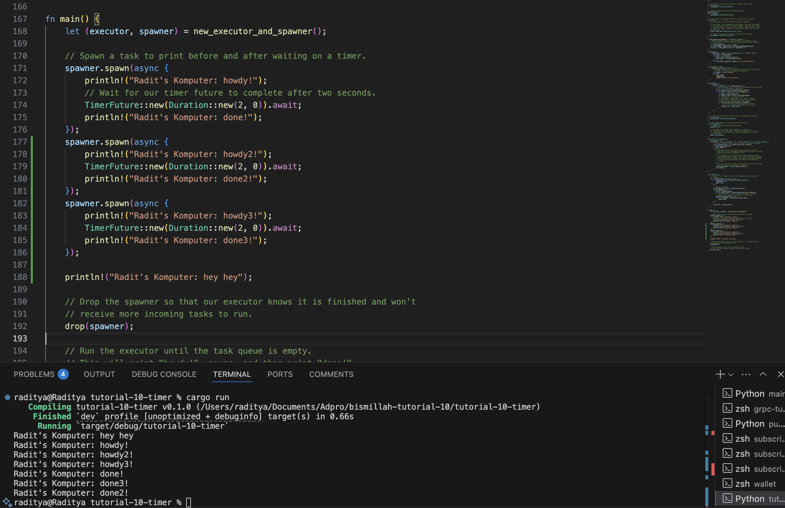
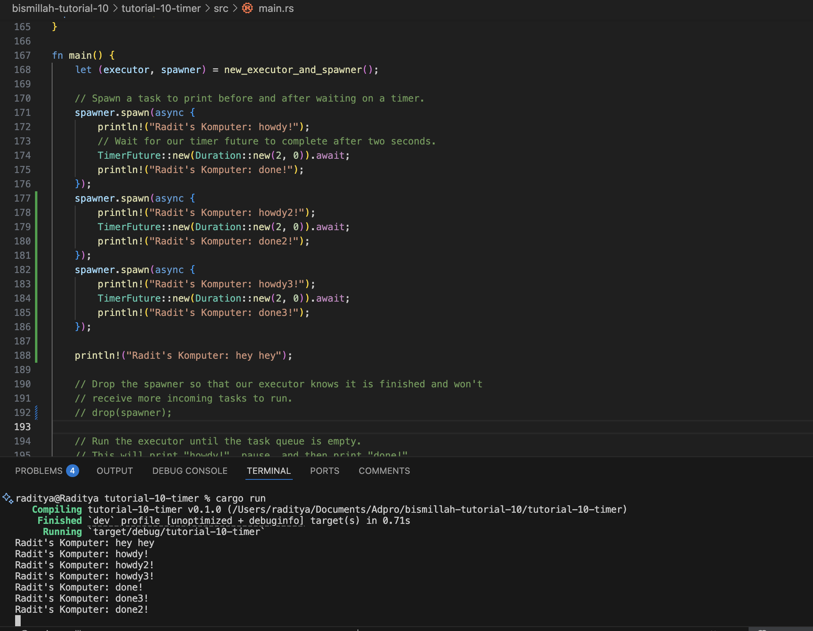

Nama: Arya Raditya Kusuma
NPM: 2306215816
Kelas: B

# 1.2

Explanation: For Experiment 1.2, I added a new print statement, println!("Radit's Komputer: hey hey");, right after the spawner.spawn(...) call in my main function. When I ran the program, I observed that "Radit's Komputer: hey hey" appeared on the console first, followed by "Radit's Komputer: howdy!", and then "Radit's Komputer: done!" after the two-second delay. This output order occurs because the spawner.spawn() function is non-blocking; it schedules the asynchronous task containing the timer and the "howdy!"/"done!" messages but doesn't wait for it to complete. Therefore, my synchronous println!("Radit's Komputer: hey hey"); statement executed immediately after the task was spawned. It's only when executor.run() is called that the executor actually polls the spawned future, leading to the execution of the asynchronous code which includes the TimerFuture.

#1.3

Explanation: In Experiment 1.3, I first explored multiple spawns by queuing three asynchronous tasks using spawner.spawn(). As observed in the first screenshot, the "hey hey" message printed, followed by all the "howdy" messages from the spawned tasks, and then, after their respective delays, the "done" messages appeared, after which the program terminated. This demonstrated that the executor can handle and interleave multiple asynchronous operations. Subsequently, I commented out the drop(spawner); line. In this scenario, shown in the second screenshot, all tasks still completed and printed their "howdy" and "done" messages as expected. However, I noticed the crucial difference that the program did not terminate automatically; the executor.run() loop continued because, without drop(spawner), the executor's task queue (the Receiver) never gets closed, so it keeps waiting for new tasks indefinitely. This highlights that drop(spawner) is essential for signaling to the executor that no more tasks will be forthcoming, allowing it to shut down gracefully once the current queue is empty.