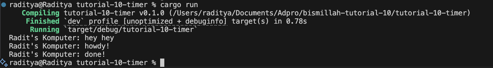

Nama: Arya Raditya Kusuma
NPM: 2306215816
Kelas: B

# 1.2

Explanation: For Experiment 1.2, I added a new print statement, println!("Radit's Komputer: hey hey");, right after the spawner.spawn(...) call in my main function. When I ran the program, I observed that "Radit's Komputer: hey hey" appeared on the console first, followed by "Radit's Komputer: howdy!", and then "Radit's Komputer: done!" after the two-second delay. This output order occurs because the spawner.spawn() function is non-blocking; it schedules the asynchronous task containing the timer and the "howdy!"/"done!" messages but doesn't wait for it to complete. Therefore, my synchronous println!("Radit's Komputer: hey hey"); statement executed immediately after the task was spawned. It's only when executor.run() is called that the executor actually polls the spawned future, leading to the execution of the asynchronous code which includes the TimerFuture.